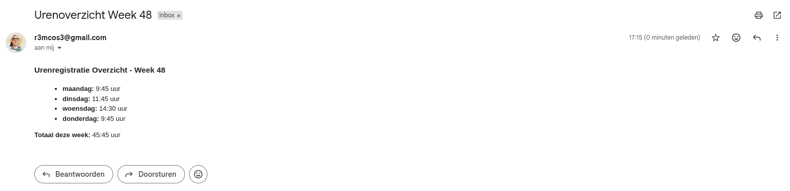

# Hours Registration Workflow

This directory contains an n8n workflow that allows you to easily register your worked hours via a web form. The entered data is automatically written to a Google Sheet, including calculated totals.

## Files

- `hours_registration.json`: The workflow file that you can import into n8n.

## Functionality

*   **Daily Registration:**
    *   **Form:** Asks for Date, Start Time, End Time, and Break (optional).
    *   **Calculation:** Automatically calculates:
        *   **Total Duration:** The total time between Start and End.
        *   **Worked Hours:** The total time minus the break.
    *   **Google Sheets:** Appends a new row with all this data to the connected sheet.

*   **Weekly Report:**
    *   **Schedule:** Runs automatically every Sunday at 18:00.
    *   **Analysis:** Reads the Google Sheet entries for the current week.
    *   **Email:** Sends a summary email containing:
        *   Total hours worked per day.
        *   Total hours worked for the entire week.

## Installation & Configuration

1.  **Import Workflow:**
    *   Open your n8n dashboard.
    *   Create a new workflow.
    *   Click on the three dots in the top right -> "Import from File".
    *   Select the `hours_registration.json` file.

2.  **Prepare Google Sheet:**
    *   Create a new Google Sheet (e.g., "Hours Registration").
    *   Add the following column headers in the first row (copy exactly or adjust in the workflow):
        *   `Date`
        *   `Week Number`
        *   `Start Time`
        *   `End Time`
        *   `Break in minutes`
        *   `Total Duration`
        *   `Worked Hours`

3.  **Configure Nodes:**
    *   **Google Sheets (Append & Read):**
        *   You have two Google Sheets nodes: "Google Sheets" (for writing) and "Get Sheet Data" (for reading).
        *   Open both nodes and select your Google Sheets credentials.
        *   Select the same "Spreadsheet ID" (the sheet you created) for both.
        *   Select the correct "Sheet Name" (e.g., "Sheet1").
    *   **Send Email:**
        *   Open the "Send Email" node.
        *   Select your Gmail credentials.
        *   Update the "To Email" field to your own email address.

4.  **Activate Workflow:**
    *   Click "Execute Workflow" to test the form part.
    *   Open the "Test URL" of the "Hours Form" node to see the form and submit a test entry.
    *   If everything works, set the workflow to "Active".
    *   Use the "Production URL" of the "Hours Form" node to fill in your hours daily.

## Screenshots

 

 

